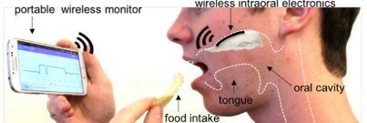

# SENSOR INTRAORAL: Validación de un Sistema para Monitoreo Continuo de pH, Temperatura y Concentración de Calcio en Saliva Artificial

¡Bienvenido al repositorio del proyecto de validación del sensor intraoral para monitoreo continuo de pH, temperatura y concentración de calcio en saliva artificial! Aquí encontrarás toda la información relacionada con el desarrollo y los resultados de este proyecto.

  

<i>Fig. 1. Representación genérica del dispositivo inalámbrico intraoral de monitoreo</i>

<i>Fuente: Lee et al., "Wireless, intraoral hybrid electronics for real-time quantification of sodium intake toward hypertension management."</i>

Este proyecto se está realizando en la Universidad Peruana Cayetano Heredia, específicamente en las Facultades de Medicina, de Estomatología y de Enfermería, durante el año 2024.

### Autores:
- CD Juan Jairo Pinedo Portugal – Estudiante Maestría en Estomatología
- Mg. Leyla Delgado Cotrina – Docente DACE
- Mg. Jorge Nelson Trevejo Pinedo – Docente DAMCIBUM
- Mg. Ing. Paulo Camilo Alberto Vela Anton – Facultad de Ciencias e Ingeniería
- Héctor Dair Alegria Cortez - Pasante LABIB

---

## Resumen
La saliva es una secreción exocrina de las glándulas salivales con utilidad diagnóstica para detectar enfermedades sistémicas. Este proyecto tiene como objetivo validar un sistema intraoral para monitoreo continuo de pH, temperatura y concentración de calcio en saliva artificial. Se utilizará la metodología VDI 2225 para el desarrollo del dispositivo, el cual estará basado en tecnología ISFET. Se realizarán pruebas para determinar la precisión y exactitud del sistema en la medición de pH, temperatura y concentración de calcio a diferentes valores y condiciones.

## Contenido del Repositorio
- [Especificaciones del Producto](Documentación/Especificacion_Producto.md): Descripción detallada del sistema y sus objetivos.
- [Lista de Requerimientos](Documentación/Lista_Requerimientos.md): Requisitos funcionales y no funcionales del sistema.
- [Estado del Arte](Documentación/Estado_Arte.md): Revisión de la literatura y tecnologías relacionadas.
- [Plan de Desarrollo](Documentación/Plan_Desarrollo.md): Cronograma de actividades y recursos.
- [Documentación Técnica](Documentación/Documentacion_Tecnica.md): Detalles del diseño y funcionamiento del sistema.
- [Resultados de Pruebas y Validación](Documentación/Resultados_Pruebas_Validacion.md): Informes y datos obtenidos durante las pruebas.
- [Modelos CAD](Documentación/Modelos_CAD.md): Archivos de diseño del sistema.
- [Código Fuente](Documentación/Codigo_Fuente.md): Software aplicado en el proyecto.
- [Referencias Bibliográficas](Documentación/Referencias_Bibliograficas.md): Lista de referencias citadas.
